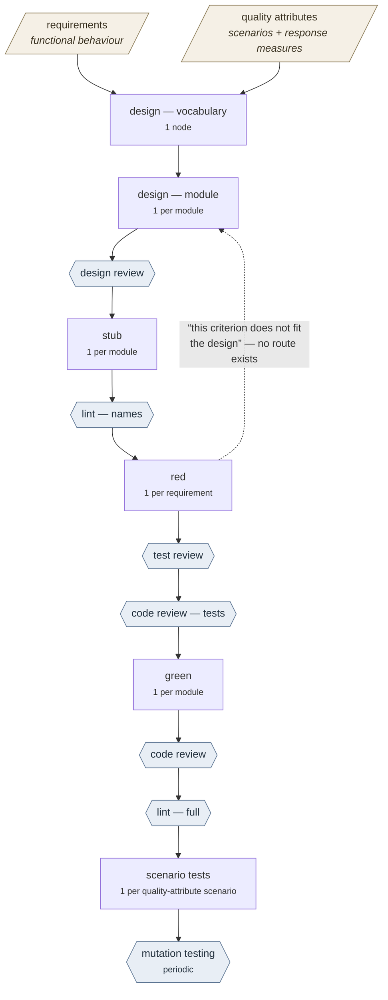

# A test-first flow for building software from a specification

## What this document is

There are two pieces of machinery, and they are deliberately separate.

**The engine** schedules work. It is given a graph of work items and a flow, it runs the items in
dependency order, and it records what happened. It knows nothing about software, testing, or any
particular product. It is described in its own requirements document.

**A flow** is an arrangement of work: which stages exist, what one unit of work is at each stage,
and what decides whether a stage's output is good enough to go on. A flow is configuration, not
code. The engine can run any flow.

This document describes **one flow**: turning a written specification into a tested implementation,
test-first, with AI workers doing the writing and a mix of tools and reviewers doing the judging.
Nothing here is tied to a particular product. Where a concrete number helps — how many work items a
stage produces, say — it comes from the project this flow was first designed against, and it is
marked as an example rather than a property of the flow.

---

## Vocabulary

These words have narrow meanings below. They are the engine's terms, and using them loosely is how
this kind of document becomes unreadable.

**Graph.** The list of work items and which items depend on which. Supplied per run.

**Node.** One item of work in the graph. Nodes travel the flow independently: a node starts as soon
as the nodes it depends on have finished, not when its stage's turn comes. There is no notion of
"the whole stage is now running" — that would be a wave schedule, and this is a dataflow one.

**Unit of work.** What one node *is* at a given stage. This is the most consequential choice in a
flow. If the unit is a requirement, you get one node per requirement; if it is a module, one per
module. Choosing badly is what turns a stage that could run 36 ways in parallel into a chain.

**Station.** One position in the flow. A station names a pass to run, where a node goes when it
passes, and where it goes when it fails (with a maximum number of attempts).

**Pass.** The definition of the work itself: the prompt, the document the worker should read, what
evaluates the result, what program to launch, which model. Stations reference passes, so two
stations can run the same pass with different routing.

**Worker.** The process a station launches for a node. Usually an AI agent handed a brief. It can
equally be a shell command — a station that runs a linter is a station like any other.

**Brief.** The document the worker reads. Briefs are generated from a template, never hand-edited,
so that every node at a stage is given the same instructions and the results can be compared.

**Result object.** A small structured file the worker writes when it is done. It is the *only*
evidence that the node finished: a worker whose process exits without writing one has stopped, not
finished. Downstream nodes read the result object rather than reading the work itself, so it has to
carry a summary and a handoff, and it is rejected if it omits either.

**Evaluator.** Whatever produces the verdict for a node. Three kinds: check that a well-formed
result object exists; run a shell command and look at its exit status; or ask an AI reviewer.

**Verdict.** Pass or fail. The engine uses it only to decide where the node goes next.

**Gate.** Informal name, used throughout this document, for whatever judges a stage's output —
sometimes an evaluator attached to the pass, sometimes an entire review station downstream.

**Attempt, and DEAD.** A failing node is routed somewhere (usually back to its own station) and
tried again up to a limit. A node that exhausts its attempts is dead, and everything that depends
on it never runs. This matters for brief-writing: whatever costs a worker an attempt is what
workers learn to avoid.

**Provenance.** Results are immutable and addressed by reference, and each one records the
references of the inputs it was built from. That chain is how any artifact can be traced back to
the specification text it came from.

**Reading the passes below.** Each names its **unit**, its **input**, its **output**, and its
**gate**.

---

## The two specifications

This flow takes two specification documents as input, and they are different in kind. Conflating
them is a common and expensive mistake, because the checks that work on one do not work on the
other at all.

### Functional requirements

A functional requirement says what the system does, and its **acceptance criteria** are numbered
propositions about one operation, each true or false of a running system:

> **REQ-045.3** — When the store is empty, `list` returns an empty array rather than null.

This form is mechanically enforceable. A criterion can be given a stable identifier, a test can
name that identifier, and a script can then check that every criterion has a test and every test
names a real criterion. That two-way check — every requirement implemented, every artifact
justified by a requirement — is **bidirectional traceability**, and it is the same technique
safety-critical software standards mandate for the same reason (DO-178C for avionics, ISO 26262 for
automotive, IEC 62304 for medical devices). It is not novel; it is just rarely automated.

### Quality attributes

The second specification covers the properties that acceptance criteria cannot express:

- **Maintainability** is a property of the whole, not of any single requirement. There is no
  operation whose behaviour it constrains.
- **Comprehensibility** is likewise about the artifact, not its behaviour.
- **Performance under composition** is emergent. Every operation can meet its own latency criterion
  and the system still be slow, because the cost is in how they are combined.
- **Cost**, both to run and to build, is a consequence of design choices and appears in no
  requirement.

Written as requirements these are aspirational: "the system SHALL be maintainable" has no criterion
that means anything. The form that makes them concrete is the **quality attribute scenario** —
source, stimulus, artifact, environment, response, and a **response measure**:

> A developer adds a new message class to the codebase at design time; the change is confined to
> one module and under 40 lines, with no change to any other module's signature.

> 1000 concurrent sends arrive at a server under normal load; every send is assigned a unique
> sequence number with no gap, and the 99th percentile latency stays under 50ms.

The response measure is what makes a scenario reviewable rather than aspirational. This form is the
Software Engineering Institute's, from *Software Architecture in Practice*. ATAM — the Architecture
Tradeoff Analysis Method — is the structured review built on it, and what it produces is a list of
risks, sensitivity points and tradeoff points rather than an opinion.

Quality attribute scenarios land in three different places in this flow, and none of them is the
requirements document:

- **Global mechanical rules.** "The dependency graph is acyclic." "No module exports more than N
  constructs." "Nothing under the record layer imports the transport layer." These constrain the
  *solution* rather than the product, so they belong in the flow's own configuration — as linter
  and dependency-analysis rules — and not in a specification of the product at all.
- **Scenario tests.** Performance and user-journey scenarios become tests, but they cut *across*
  requirements, so they cannot be generated one-per-requirement the way ordinary tests are. That is
  a separate pass with a different unit of work.
- **Human review against the scenarios.** The tradeoffs — maintainability against performance,
  comprehensibility against compactness — are what ATAM structures, and structuring the review is
  what stops it being an opinion.

---

## The chain

Rounded boxes are specifications, hexagons are gates, rectangles are worker passes with their unit
of work. The dashed edge is the largest known gap — see **Open**.

**Red and green** are the two halves of test-driven development, and they are used here in their
usual sense. *Red* means writing a test that fails, before the code exists — the failure is the
proof that the test is measuring something. *Green* means writing the smallest implementation that
makes it pass. Splitting them across separate passes with separate workers is what makes the
discipline enforceable rather than a habit: the worker who writes the test cannot quietly weaken it
to match an implementation it never saw.

**For scale.** On the project this flow was designed against, the requirements specification holds
68 requirements and 504 acceptance criteria, about 19,000 tokens of requirement text, and the
design pass split it into roughly three dozen modules. So the red pass is around 68 nodes, and the
module passes around 36. Those numbers are illustrative; the flow does not depend on them.

Four things about this shape are load-bearing.

**Design comes before anything is built.** A requirements specification is behavioural: it
constrains fields and outcomes, never signatures. On the example project, 250KB of specification
text contained about three type signatures in total — the interface is essentially absent, as it
should be. So if module-sized workers write stubs directly from the requirements, each one invents
an interface and they do not fit together. This is not hypothetical: at the level below, one red
pass was run without naming which module each test should import, 65 workers each invented a path,
and the resulting suite imported 40 different ones. Sixty-five tests describing forty systems.

**Stubs come before tests.** Without a stub, a red test fails because the module cannot be
resolved. That is not a red phase, it is a spelling check — it would fail identically for a
misspelled filename. With a stub in place, the test fails on an assertion about a *value*, which is
the thing the requirement actually says.

**Review is never an evaluator.** A pass that judges other work is a station like any other, with a
brief and a result object of its own. The engine routes on verdicts; it does not compute them, and
it has no opinion about what makes work good. That is entirely the flow's business.

**There are two specifications, not one** — as above. The design pass takes both.

---

## The passes

### design — vocabulary

- **Unit.** The whole specification. One node.
- **Input.** All requirements, and the quality attribute scenarios — the module split is one of the
  main things the maintainability scenarios constrain.
- **Output.** The shared type vocabulary, and which module owns which requirement's constructs.
- **Gate.** Every requirement is assigned to exactly one module.

**Why one node.** This is the only globally coupled decision in the chain, and it is small: a
vocabulary and an ownership table, a few KB of output from perhaps 19,000 tokens of input.
Everything else is local to a module once this is fixed. Making the unit the requirement instead
would serialise the entire design into a chain as long as the requirements list, because each
requirement's types would depend on every earlier requirement's — the second requirement must know
what the first one named, and so on to the end.

### design — module

- **Unit.** One module. Flat, all nodes depending only on the vocabulary node.
- **Input.** The vocabulary result, and this module's requirements in full.
- **Output.** Three things:
  1. The module's constructs — signatures, parameters, return types.
  2. The mapping from each construct to the requirement criteria it satisfies.
  3. **The decisions it made, and why** — why this split, why this type is shared, what it
     considered and rejected.
- **Gate.** design review.

**Rationale is a deliverable, not a courtesy.** A design that emits only signatures and a mapping
gives a reviewer nothing to push on: you cannot review a decision you cannot see. It is also the
one input the mechanical checks cannot produce, and therefore the only material the human half of
design review has to work with.

### design review

- **Unit.** The whole design.

Three kinds of question, answered three different ways. The mistake to avoid is sending all of them
to a single reviewer and asking "is this a good design?" — that produces fluent agreement in either
direction, and would be the one gate in the chain that measures nothing while appearing to measure
the most.

**What scripts decide — cheapest first, no agent involved:**

1. **Coverage.** Every acceptance criterion is claimed by exactly one construct. Unclaimed means a
   requirement nothing implements. Claimed twice means the ownership split is wrong.
2. **Citations resolve.** A claim against criterion 135.4 requires that requirement 135 actually
   has a fourth criterion. This catches invented traceability, which is precisely the failure a
   mapping invites: it is easier to cite a plausible identifier than to find the right one.
3. **It compiles.** This is the argument for expressing the design as type declarations rather than
   prose — a design you cannot run a compiler over has discarded its best available check. It also
   subsumes vocabulary closure, since a reference to an undefined type *is* a compile error.
4. **Names and boundaries.** The same linter and dependency-analysis rules described under
   **lint — names** below.
5. **Graph metrics.** Fan-in and fan-out per module, exports per module, depth of the dependency
   chain, instability and abstractness. All computable from the design alone, and they are the
   design-time proxy for maintainability. Where the thresholds sit is a judgement call; the numbers
   themselves are not.

**What red decides later.** Whether each claim is *plausible* has no script. Coverage checks that a
construct claims a criterion; it can never check that the construct could satisfy it, so a worker
can satisfy coverage perfectly by assigning criteria arbitrarily. That is the same question the red
pass answers empirically, per criterion, with a reason attached — which is why deferring it is
cheap. An agent can preview it, framed narrowly — *"could a test exercise this criterion through
this signature, and if not, why"* — one claim at a time. Rank the claims first by embedding
similarity between criterion text and construct signature: far too imprecise to gate on, but it
turns an unbounded review into a shortlist of the least plausible.

**What a human decides now, because the feedback loop is too long to defer.** Testability is cheap
to defer, since red is the very next pass. These are not, because the pass that would reveal them
is green, and by then the product is built:

- **Satisfaction of the intended use case.** Traceability proves conformance to a *model* of
  intent, not to the intent. Every criterion can pass and still leave a product where the common
  case takes six calls, because per-criterion tests systematically miss composition.
- **Comprehensibility.** Naming rules scratch the surface. One probe is genuinely falsifiable: hand
  the design to a reader cold, ask what the system does, and compare the answer against the
  requirements. If intent cannot be reconstructed from the artifact, comprehensibility is poor.
- **Performance under composition.** An N+1 read pattern or an O(n²) verification is visible in the
  design to someone looking for it, and measurable only after green. Identify the hot paths from
  the requirements and check the design's complexity along those.
- **Cost.** Runtime cost is a design consequence. Build cost is estimable in advance — module count
  times observed per-node cost gives a green-phase budget before committing to it.
- **The tradeoffs among all of the above**, which is what ATAM exists for.

### stub

- **Unit.** One module.
- **Input.** The design for that module.
- **Output.** Signature-only source: every construct present, no logic. **Type-correct empty
  returns** (empty array, null, empty string, false), *not* a thrown "not implemented" error.
- **Gate.** The type declarations emitted from the stub match those in the design.

**Why empty returns rather than throwing.** A throw makes every test fail with the same
`not implemented` message, which is barely more informative than a missing module and is not the
same thing as "the condition evaluates false". An empty return makes the test fail on the *value*,
which is a genuine assertion failure.

It also makes the stub tree a mechanical definition of "empty repository": run the test suite
against the stubs and **any test that passes is vacuous, by construction** — it asserted something
that is true of a system that does nothing. There is otherwise no way to check that.

The cost is honest: criteria that assert an *absence* pass against an empty-returning stub and get
flagged as vacuous when they are not. Those criteria need to be tested by what would regress
instead — name the change that would violate the constraint and test for that — so the flag is
arguably correct, but it needs a hand-check the first time through.

### lint — names

- **Unit.** The stub tree.
- **Gate.** Mechanical, two tools:
  - A naming-convention rule that forbids digits in identifiers, plus a minimum identifier length.
    This catches `d1`, `R7`, `t2`, `x` — the machine-generated names that agents fall back on when
    they have not decided what a thing is.
  - A dependency-analysis rule on filenames. This needs **three** rules rather than one, because
    such rules fire per dependency edge: a rule written on the *source* side of an edge never sees
    a file that has no dependencies at all. So it wants a source-side rule, a target-side rule, and
    an orphan rule. (The tool in use also refuses regular expressions with lookahead as unsafe, so
    each rule must forbid the bad shape rather than require the good one.)

**Why here and not after green.** A name chosen in the design propagates into every stub file,
every test name, and every result object downstream. By green it is expensive to change. The stub
tree is the earliest point at which the names exist as code.

Neither tool catches the harder failure: `function processData(thing: Item)` passes every rule and
names nothing. Cryptic names are mechanically detectable; *empty* ones are not. That stays an item
in the review brief, with concrete examples, rather than a gate.

### red

- **Unit.** One requirement.
- **Input.** The requirement in full, and the stub's signature for each construct it names.
- **Output.** One failing test per acceptance criterion, in a file whose path mirrors the module.
- **Gate.** The evaluator checks only that the tests evaluate false and are non-vacuous.

**The test layout mirrors the module** — a folder per module, one file per requirement inside it.
Folder rather than a single file per module, because separate files can be generated in parallel.
Five workers writing into one file would create write contention, and contention would have to be
modelled as dependencies, which would turn a flat parallel stage back into a chain.

The mirror is mechanically enforceable: dependency-analysis rules support a backreference from a
capture group in the source path into the target path, so a test at `tests/<path>/req-<n>.test.ts`
can be *required* to depend on `src/<path>.ts`. The tool sees dynamic `await import(...)` calls and
resolves the ESM `.js` extension convention back to `.ts` source, so neither the
import-inside-the-test-body rule (below) nor the extension convention blinds it.

**Why tests import inside the test body.** A top-level import of a module that does not resolve
stops the whole file from loading, so none of its tests register and the per-criterion result is
lost — the file reports zero tests, which reads like the worker failed when in fact it never ran.
Importing inside each test body confines the failure to that test.

### test review

- **Unit.** One requirement's test file.
- **Gate.** Judgement, against a written standard.

**The division from the red evaluator is deliberate.** The evaluator accepts that a test fails. The
reviewer decides *why* it failed, and rejects "it fails because the module is missing". The module
must exist, take the parameters the acceptance criteria require, and fail because the condition
evaluates false when it actually runs.

**Red is the operational definition of design quality.** A design is good if tests can be written
against it. A criterion that cannot be expressed as a test against the designed signature is a
design failure, reported per criterion with a reason. That signal is trustworthy precisely because
it comes from a worker doing honest downstream work rather than from a reviewer asked to have an
opinion. It is not the *whole* of design quality — see design review above for the parts it cannot
reach — but it is the part that gets measured for free.

**Which creates one hazard.** Workers are agreeable. Handed an awkward interface, a red worker will
contort a test to fit rather than report the design as unusable — and a red phase that passes for
that reason means nothing. So "this criterion does not fit the design" must be a **valued result,
not a failed attempt.** If reporting a design flaw burns the node's attempt counter and pushes it
toward DEAD, every worker learns to contort instead. This is a brief-writing and routing
requirement, not a suggestion.

### code review — tests, and code review

Two gates, on the tests and on the implementation respectively. **What separates the test-side gate
from test review, which sits immediately before it, is not yet decided** — see **Open**. Until it
is, neither has a unit, an input or a standard written down, and a gate with no written standard is
not a gate.

### green

- **Unit.** One module.
- **Input.** The module's design, its stub, and every test written against it — which is every test
  file in the folder that mirrors the module.
- **Output.** The implementation. The stub's signatures become working code.
- **Gate.** Every test for that module passes, **and no test file was modified.**

**Why the unit is the module and not the requirement.** An implementation is a module. Requirements
overlap inside one — two requirements will often be satisfied by the same function, or by functions
that share state — so a worker given one requirement at a time would be writing partial
implementations of code another worker is simultaneously writing. The unit has to be the thing that
gets written, and that is the file.

**This is the first fan-in in the chain.** Every stage up to here is either one node or a flat set
of independent ones. A green node depends on *all* the red nodes for requirements its module owns,
so it cannot start until the last of them is finished and reviewed. That makes green the stage
where a single slow or dead red node stalls a whole module rather than one requirement.

**"No test file was modified" is the load-bearing half of the gate.** Red exists to write tests
that fail; green exists to make them pass. A green worker that can edit the tests can satisfy its
gate by deleting an assertion, and it will, because that is by far the cheapest route to a passing
suite. Separating the two passes across separate workers is what makes test-driven development
enforceable rather than a habit, and it only works if the second worker cannot reach back into the
first one's output. This is a check on the diff, not an instruction in the brief — an instruction
is a request, and the whole point is that it must not be one.

**Factoring is measured here, not by red.** A design that dumps every criterion onto one
god-module passes red perfectly well — the tests do not care how many files there are. It fails at
green, mechanically: green's graph has one node per module, so bad factoring shows up as a stage
that cannot parallelise, whose nodes collide on the same files, and whose single fat node takes as
long as the rest of the stage put together.

### lint — full

- **Unit.** The implementation tree.
- **Gate.** The complete rule set — everything from **lint — names**, plus the rules that need
  logic to inspect and therefore could not run against a stub: complexity limits, dead code,
  unreachable branches, and the architectural boundary rules that say which module may import
  which.

The boundary rules are where the global quality attributes land. "Nothing in the storage layer
imports the transport layer" is not a statement about any requirement, and this is the station that
enforces it.

### mutation testing

- **Unit.** The implementation, or a subset of it.
- **Gate.** A minimum proportion of introduced faults are caught.

Mutation testing deliberately corrupts the implementation — flips a comparison, deletes a
statement, changes a constant — and checks that some test notices. A mutant that survives is a
piece of behaviour no test constrains.

This is the rigorous answer to test vacuity, and it is much stronger than the stub check described
under **stub** above. "The test fails against an empty implementation" only proves the test
distinguishes *something* from *nothing*; mutation testing proves it distinguishes the right
behaviour from a plausibly wrong one. It cannot run before green, because there is no
implementation to mutate.

The cost is that it runs the suite once per mutant, so it is a periodic gate rather than a per-node
one — a scheduled run over the whole tree, not something in the path of every module.

### scenario tests

- **Unit.** One quality attribute scenario.
- **Input.** The scenario, with its response measure.
- **Output.** A test that exercises the scenario end to end and asserts the response measure.

**Why this cannot be folded into red.** A scenario cuts *across* requirements — it is a user
journey, or a load profile, or a change applied to the codebase and then measured. Red's unit is
one requirement, so red can never produce these however thorough it is. Five hundred per-criterion
tests all passing is entirely consistent with a product that does not do the job, because
composition is exactly what per-criterion testing does not reach.

Performance scenarios become benchmarks with thresholds. Maintainability scenarios become an
exercise — apply the stated change, measure how many modules and how many lines it touched —
which is runnable, if not on every commit.

---

## Rules that apply to every station

**A tool's exit code is necessary and never sufficient.** An evaluator that exits 0 having examined
nothing reports success. This is not a theoretical worry: a dependency-analysis run against an
unsupported compiler version printed `no dependency violations found (0 modules, 0 dependencies
cruised)` and exited 0, because it had silently parsed nothing. That is the same defect as an
evaluator accepting a test file that registers zero tests. So every tool station must assert a
floor — *N modules examined, N tests run* — against a count known in advance from the graph.

**Several stations are tools, not agents.** Coverage, citation resolution, compilation, vocabulary
closure, naming, boundaries. A station that shells out and writes a result object is cheaper,
faster and far more trustworthy than one that asks an agent for an opinion, and moving this work to
tools pushes agents toward the parts that genuinely need judgement.

**Nothing checks the two specifications.** Everything below them is checked by traceability back to
them. That is the irreducible trust in the flow, and it belongs exactly there — they are the
documents a human wrote.

But note what that means for the *shape* of that trust. Conformance to the functional requirements
is mechanically checkable, so that document carries its own enforcement. The quality attributes do
not work that way. Some become rules, some become scenario tests, and the rest are only ever
honoured by a human who has read them and is looking for them. **A quality attribute nobody reads
at design review is not enforced by anything downstream.**

---

## Open

### In the flow

**Who writes the verdict.** The engine currently computes the verdict and routes on it, but under
the principle that the engine should know only about result objects and their provenance, the
verdict ought to come from a result object. Two options. Either a worker verdicts its own attempt —
and a broken worker writes `pass`. Or a station's verdict is about the work it *received*: red
always emits and moves on, and the test review station's result carries the verdict on red's work.
The second is what this flow implies throughout, since every stage here already has a downstream
judge.

**Failures cannot reach back to the design.** If red is the operational definition of design
quality, then a red failure meaning "the design is wrong" needs a route back to the design pass.
There is none. A station's fail route names another *station*, not another node, so a failing
requirement cannot reopen the module node that designed the construct it is failing against — and
if the design ran in an earlier run with a different graph, there is no route at any level. This is
the largest structural gap in the flow, and it is the dashed edge in the diagram.

**Nothing yet forces a tool station to prove it examined something**, which is what the exit-code
rule above requires. It is a rule the flow states and the engine does not enforce.

**What separates test review from code review — tests.** The chain puts two consecutive gates on
the same artifact and does not say why. One reading is that they ask genuinely different questions:
test review asks whether a test *measures its criterion* — does it fail for the right reason, is it
vacuous, does the criterion even fit the design — while code review asks whether it is decent
*code*, which is duplication across files, fixture hygiene, assertions buried in helpers, names
that describe nothing. That is the half a linter cannot reach. The other reading is that the second
gate is redundant and the node should come out of the chain. Undecided, and until it is decided
neither that station nor the implementation-side code review has a written standard.

### For the current project

**The quality attributes document does not exist.** The design pass takes two specifications and
only the functional one has been written. Until the second exists, design review has nothing to
check but conformance — which is why, for a while, it looked as though the whole gate could be
scripts.

**The dependency-analysis tool cannot run against this repository.** dependency-cruiser supports
TypeScript below 7.0.0; this project is on 7.0.2, and as noted above the failure is silent. The fix
is not to downgrade the project: an evaluator has no reason to share the project's toolchain, so
the station can run the tool from its own directory against its own pinned version.
